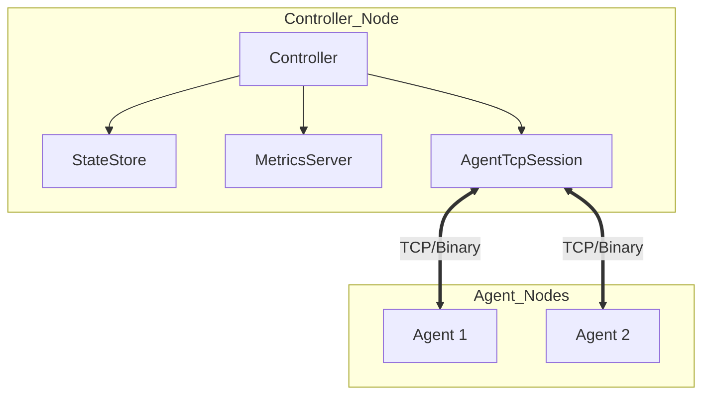
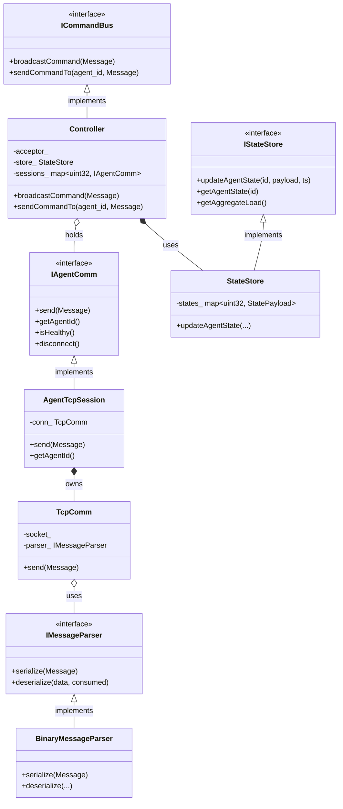
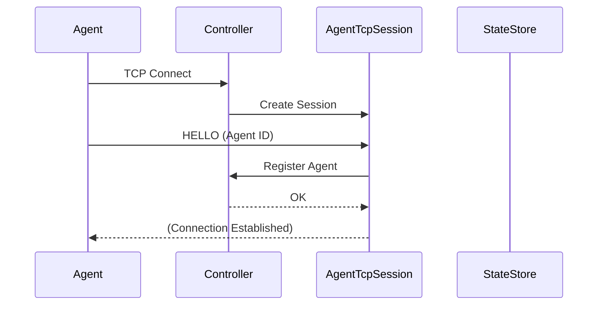
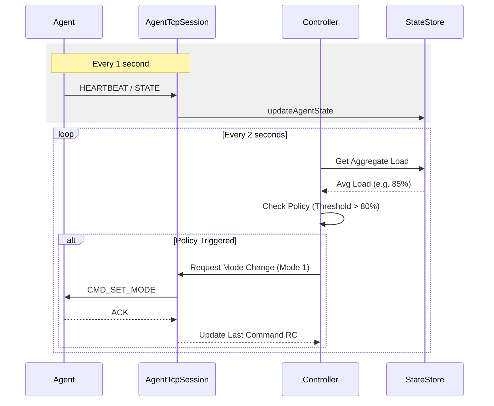

# System Design & Architecture

## Architecture Overview

시스템은 중앙 집중식 **Controller**와 분산된 **Agent**들 간의 Binary Message 기반 통신 구조를 가집니다.

## Class Diagram (Interface-based Architecture)

## 클래스 책임 (Responsibilities)

| Component | Responsibility |
| :--- | :--- |
| **Controller** | 에이전트 연결 관리, 정책(Policy) 트리거 로직, 명령 브로드캐스트 |
| **AgentTcpSession** | 개별 에이전트와의 세션 상태 유지, 메트릭 측정, 재시도 제어 |
| **Agent** | 시스템 상태(CPU/Temp) 수집 및 보고, 수신된 명령 실행 |
| **TcpComm** | (Core) ASIO 기반 비동기 스트림 처리 및 에러 핸들링 |
| **BinaryMessageParser** | (Core) 가변 길이 바이너리 프로토콜 직렬화/역직렬화 |

## Sequence Diagrams

### 1. Connection & Registration (Handshake)

새 에이전트가 접속하고 컨트롤러에 등록되는 과정입니다.

### 2. Reporting & Policy Execution

