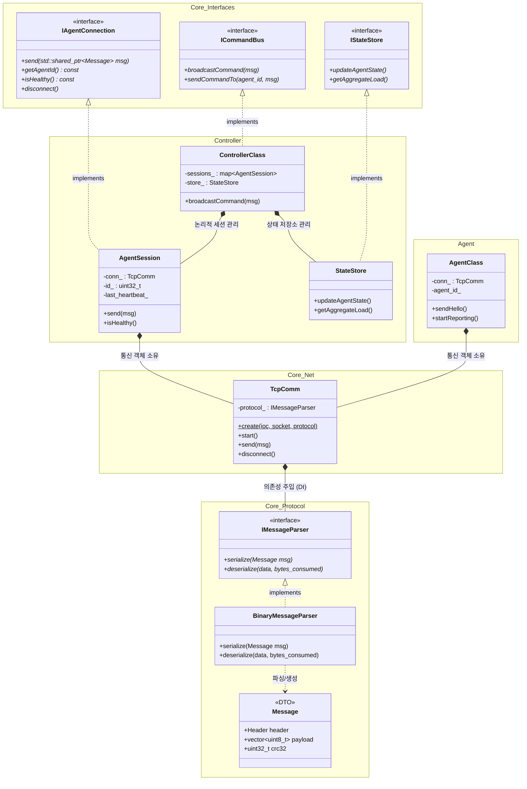

# Software Architecture UML

이 문서는 프로젝트의 전체적인 클래스 구조와 객체 지향적 의존 관계를 설명하는 UML 모델입니다. 
Markdown 내장 **Mermaid** 문법을 사용하여 작성되었습니다. (VS Code 등에서 Mermaid 익스텐션이나 GitHub를 통해 시각적으로 렌더링해서 볼 수 있습니다.)

## 1. 종합 클래스 다이어그램 (Class Diagram)

아래 다이어그램은 `Core`, `Controller`, `Agent` 계층별 인터페이스 상속 구조와 의존성(Composition/Has-A)을 나타냅니다.

## 2. 아키텍처 주요 포인트 설명

* **Core 계층 (`Core_Net`, `Core_Protocol`)**: 오직 소켓 비동기 통신과 바이트 배열 파싱만 담당하는 하위 수준의 부품들입니다.
* **Controller 계층**: `TcpComm`이라는 통신 부품을 주입받은 `AgentSession`을 통해 상태와 비즈니스 로직(ID, Heartbeat 확인 등)을 처리합니다.
* **비즈니스 로직과 통신의 완벽한 분리**: 인터페이스(`IAgentConnection`, `ICommandBus` 등)를 통해 구현체 간 강한 결합을 피하면서 높은 수준의 객체지향 설계(SOLID)를 유지하고 있습니다.
* **의존성 역전 원칙(DIP)**: 통신 객체(`TcpComm`)는 특정 파싱 규칙에 종속되지 않고 언제든 다른 파서로 갈아끼울 수 있도록 추상화된 `IMessageParser`에만 의존합니다.
