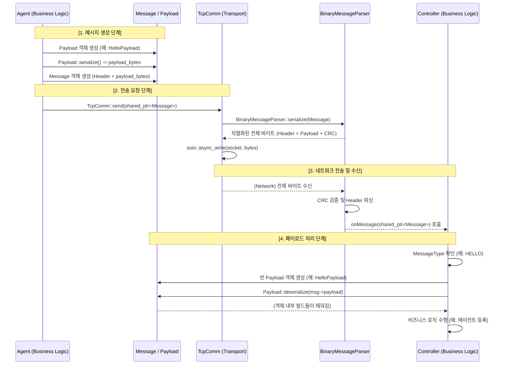

# Message Sequence Diagram

This diagram illustrates the flow of a message from the Agent (Sender) to the Controller (Receiver) in the current architecture.

## Key Components

1.  **Payload (IPayload)**: Responsible for serializing/deserializing the business-specific data fields.
2.  **Message**: A container that wraps the payload bytes with a common protocol header (ID, type, timestamp, flags).
3.  **BinaryMessageParser**: Handles the low-level framing, including header serialization, byte order conversion (Big-Endian), and CRC calculation.
4.  **TcpComm**: Manages the ASIO socket and the lifecycle of outbound/inbound byte streams.
